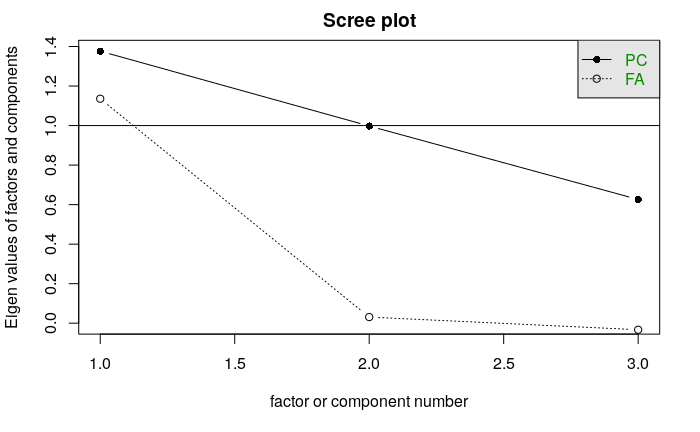

# 1. Introduction

@lijphart_pod argues that consensus democracy reduces social inequality due to
increased representation of minority voices, but @tsebelis_vp provides that
the profusion of political actors could also cause policy gridlock [^1] and stymie
the decisive political action needed for redistribution.

[^1]: Conditional on moderate to high levels of ideological polarisation and
  internal policy congruence of veto players.

*Prima facie*, Lijphart's regressions seem to provide strong empirical evidence
for his theory. However in this essay, I demonstrate that Lijphart's regression
results cannot be taken at face value due to the presence of time- and country-
based heterogeneities as well as the methodological flaw of selecting on the
dependent variable.

I then use fixed-effect panel regressions that control for unobserved
heterogeneities at the time- and country- level to attempt to replicate and
extend Lijphart's findings more robustly. I begin by replicating Lijphart's
analysis on his original 36 democracies, then expand the analysis to include 31
new democracies that have since fulfilled Lijphart's criteria of 20 years of
continuous democracy.

Due to the lack of data I could not replicate Lijphart's results on economic
inequality. However, I successfully replicate Lijphart's results on gender
inequality at the 1% significance level---and show that after controlling for
heterogeneity and/or extending his analysis to include new democracies, these
results are no longer significant.

I am unable to make claims about consensus democracy *vis-a-vis* economic
inequality but can definitively reject the claim that consensus democracy
reduces gender inequality. I also conclude that there is an urgent need for free
and open data in the interests of conducting and replicating key results in
political science.

# 2. Theoretical argument

@lijphart_pod argued that the executive-parties dimension of consensus
democracies (greater effective number of parties, less government
fractionalisation and electoral disproportionality) better incorporate multiple
voices and points of view. As such, consensus democracies can better serve the
needs of not just the majority but also underprivileged and marginalised
minorities, and in this way reduce social inequality.

On the other hand, it could be the case that consensus democracies are less
decisive and cannot enact the large and substantial political change needed for
true social redistribution. @tsebelis_vp provides a theoretical basis for
such a claim in *Veto Players*: the more *veto players* (political actors whose
agreement is necessary to enact political change) are present in a system, the
less likely it is that there will be an acceptable policy outcome, and policy
gridlock will result.

Tsebelis's veto players framework is well-supported by empirical evidence:
@samuels_sop found that policy change is "$...$slower and less dramatic under
presidential systems than parliamentary ones, all else equal" due to the
addition of an extra veto player (the president). Consensual democracies exhibit
greater legislative heterogeneity, as they have electoral systems that allow
smaller, fringe political parties to win seats in the legislature. Legislative
heterogeneity has been shown to lead to policy gridlock [see @binder_1999]. For
these reasons, consensus democracies may fail to reduce social inequality if
policy gridlock prevents governments from enacting the broad, sweeping
redistributive policies that reduce social inequality.

Both theories are plausible, so we must look to the empirical evidence to
distinguish between the two. I now look at Lijphart's findings and explain why,
due to several methodological flaws, they cannot be accepted as evidence for the
claim.

# 3. Methodological criticisms

Lijphart runs many multivariate regressions and finds that consensus democracy
(operationalised by the executive-parties dimension) is negatively correlated
with social inequality. However there are three confounders that reduce
the validity of his data.

First of all, Lijphart's data suffers from country-level heterogeneity. While
social inequality can be mediated through political systems, it is to a large
extent dependent on many historical and cultural factors that may drive both the
formation of consensual democratic institutions and policies that reduce social
inequality. Suppose that a group of countries possess some common factor
(climate, culture, public *zeitgeist*) that causes them to pursue consensual
institutions and reduce social inequality; for example, Japan's communitarian
culture results in both consensual political behaviour and redistributive social
norms. Then a spurious correlation would emerge between consensus democracy and
social inequality. Introducing fixed effects removes the influence of any unknown common factor.

Time-level heterogeneity is also present. For example, taking the Gini
coefficient circa 2000 leaves him open to criticism regarding the choice of time
period. Lijphart used the Gini coefficient circa 2000, the peak of the dot-com
boom. It may be the case that his relationship no longer hold in a recession,
when only the decisiveness of majoritarian systems can enact stimulus spending.
[^5] To rule out such a possibility, therefore, panel data must be used to control
for time-level heterogeneities.

[^5]: As mentioned earlier, consensus democracies may fail to enact stimulus
  spending if they tend towards policy gridlock.

Lastly, Lijphart's case selection falls prey to *selecting on the
dependent variable*. In his case selection, Lijphart selects only countries that
have a Freedom House rating of "Free". This is problematic as Freedom House is a
substantive measure that includes civil liberties in its operationalisation of
democracy. That Civil Liberties index includes the requirement that a state
must strive for "equality of opportunity for everyone, including women and
minority groups"[^2]. By choosing only "Free" countries,
Lijphart is guilty of selecting on the dependent variable: choosing only
countries that have a certain degree of social equality already.

[^2]: "Civil Liberties" section of https://freedomhouse.org/report/methodology-freedom-world-2018

I have identified confounders that reduce the validity of Lijphart's
regressions. Fortunately, conducting panel analysis with unobserved fixed
effects can ameliorate the effects of these confounders. However, using
panel data requires the construction of new time-series variables---the details
of which I elucidate now.

# 4. Operationalisation

To conduct panel data analysis, I must first construct time-series analogues of
the original variables. Specifically, I analyse 20 years of data (1997--2016)
for 36 and 67 countries.

I use the Quality of Government 2018 (QoG) Standard Dataset, which contains
"approximately 2100 variables from more than 100 data sources" [@qog_2018], to
create my own executive-parties dimension that hews closely to Lijphart's. To
replicate Lijphart's results as closely as possible, and to prove that my panel
data is highly relevant to Lijphart's regressions, I use all but one of
Lijphart's dependent variables.

## Executive-parties dimension

I follow William Lai's [@lai_2017] example and operationalise the
executive-parties dimension in the same way as he does. Specifically, I exclude
the measures of executive dominance and interest-group pluralism, and substitute
government fractionalisation for percentage minimal-winning cabinets.

**Effective number of parties**

I take this variable from the QoG dataset.

**Electoral disproportionality**

I pull raw data from the QoG dataset to calculate Gallagher's index of
disproportionality myself.

**Percentage minimal-winning cabinets**

As the QoG dataset does not contain data about minimal-winning cabinets, I use
the index of government fractionalisation instead. "Dodd (1976, p. 133), whose
definitions Lijphart (2012) uses, has shown government fractionalization to be
a good proxy for power sharing and deviation from minimal-winning cabinet
status." [@lai_2017].

**Executive dominance**

I excluded the measure of executive dominance because I agree with Lai's
criticism of Lijphart's operationalisation of executive dominance---Lijphart
uses his intuition to give arbitrary, impressionistic values to
non-parliamentary governments.

**Interest-group pluralism**

I excluded interest-group pluralism as it exhibits completely different
correlational behaviour compared to the other four variables [see
@giuliani_2016].

Running confirmatory principal components analysis (PCA) on the variables shows
that the variation explained drops dramatically after one factor
[\ref{ep_scree}], showing that these metrics do indeed reduce to a single
executive-parties dimension. This dimension also has high internal consistency
with a Cronbach's $\alpha$ of 0.85, which further bolsters its validity.

## Social inequality

I mostly follow Lijphart's dependent variables for social inequality: Gini
coefficient, 10/10 and 20/20 ratio and women in upper/lower houses. I do not use
the UN Gender Inequality Index, as it is only measured every five years and is
unavailable in the QoG dataset.

## Extending Lijphart's analysis to 67 democracies

I also extend the sample of democracies to include new democracies that, as of
2016, fulfill Lijphart's original criteria for country selection:

	1. Population greater than 500,000;
	2. At least 20 years of continuous democracy.

I did this because Lijphart's originally selected only those countries that were
"Free" on the Freedom House index, which makes him guilty of *selecting on the
dependent variable*: choosing only countries that have a certain degree of
social equality already. Therefore I avoid this by using the Polity IV data
series instead and select countries with a score of 6 or more for the Democracy
index, which gives us 67 democracies. For these 67 countries, I take 20 years of
time-series data from 1997 to 2016, which gives us a total of N=1340
observations.

# 5. Methodology

I run panel data regressions on the following dependent variables, both on
Lijphart's original 36 and my extended 67 democracies: 

	1. Gini coefficient;
	2. 10/10 ratio;
	3. 20/20 ratio;
	4. Percentage of women in upper house;
	5. Percentage of women in lower house.

## Lijphart's 36 countries

I first run baseline panel regressions on Lijphart's 36 countries (N=580),
without controlling for fixed effects. I fail to replicate Lijphart's findings
on Gini, 10/10 and 20/20 ratio (economic inequality). Table \ref{baseline_36_ei}
details these findings. There is a relationship between consensus
democracy and Gini at the 5% level but no relationships for 10/10 and 20/20
ratios, so results are mixed at best.

On the other hand, I replicate Lijphart's findings on gender inequality
perfectly. The relationships between consensus democracy and gender inequality
are all highly significant at the 1% level and in some cases even the 0.05%
level.

\begin{table}[!htbp] \centering 
  \caption{Baseline panel regression for Lijphart's 36 countries: Economic inequality} 
  \label{baseline_36_ei} 
\begin{tabular}{@{\extracolsep{5pt}}lccc} 
\\[-1.8ex]\hline 
\hline \\[-1.8ex] 
 & \multicolumn{3}{c}{\textit{Dependent variable:}} \\ 
\cline{2-4} 
\\[-1.8ex] & Gini & 10/10 ratio & 20/20 ratio \\ 
\\[-1.8ex] & (1) & (2) & (3)\\ 
\hline \\[-1.8ex] 
 Executive-parties & $-$0.736$^{**}$ & 0.320 & 0.114 \\ 
  & (0.353) & (0.366) & (0.147) \\ 
  & & & \\ 
 HDI & $-$10.700$^{***}$ & $-$12.241$^{***}$ & $-$5.111$^{***}$ \\ 
  & (0.664) & (0.674) & (0.271) \\ 
  & & & \\ 
 Population, logged & 0.617 & 0.576 & 0.256 \\ 
  & (0.465) & (0.487) & (0.196) \\ 
  & & & \\ 
 Constant & 42.125$^{***}$ & 21.100$^{***}$ & 10.431$^{***}$ \\ 
  & (0.546) & (0.560) & (0.225) \\ 
  & & & \\ 
\hline \\[-1.8ex] 
Observations & 219 & 197 & 197 \\ 
R$^{2}$ & 0.668 & 0.716 & 0.731 \\ 
Adjusted R$^{2}$ & 0.663 & 0.711 & 0.727 \\ 
Residual Std. Error & 3.897 (df = 215) & 3.799 (df = 193) & 1.529 (df = 193) \\ 
F Statistic & 144.241$^{***}$ (df = 3; 215) & 161.977$^{***}$ (df = 3; 193) & 175.086$^{***}$ (df = 3; 193) \\ 
\hline 
\hline \\[-1.8ex] 
\textit{Note:}  & \multicolumn{3}{r}{$^{*}$p$<$0.1; $^{**}$p$<$0.05; $^{***}$p$<$0.01} \\ 
\end{tabular} 
\end{table} 

\begin{table}[!htbp] \centering 
  \caption{Baseline panel regression for Lijphart's 36 countries: Gender inequality} 
  \label{} 
\begin{tabular}{@{\extracolsep{5pt}}lcc} 
\\[-1.8ex]\hline 
\hline \\[-1.8ex] 
 & \multicolumn{2}{c}{\textit{Dependent variable:}} \\ 
\cline{2-3} 
\\[-1.8ex] & Women in lower house & Women in upper house \\ 
\\[-1.8ex] & (1) & (2)\\ 
\hline \\[-1.8ex] 
 Executive-parties & 0.028$^{***}$ & 0.018$^{***}$ \\ 
  & (0.005) & (0.005) \\ 
  & & \\ 
 HDI & 0.067$^{***}$ & 0.040$^{***}$ \\ 
  & (0.009) & (0.009) \\ 
  & & \\ 
 Population, logged & $-$0.037$^{***}$ & $-$0.034$^{***}$ \\ 
  & (0.005) & (0.005) \\ 
  & & \\ 
 Constant & 0.205$^{***}$ & 0.216$^{***}$ \\ 
  & (0.008) & (0.008) \\ 
  & & \\ 
\hline \\[-1.8ex] 
Observations & 440 & 267 \\ 
R$^{2}$ & 0.303 & 0.226 \\ 
Adjusted R$^{2}$ & 0.298 & 0.217 \\ 
Residual Std. Error & 0.095 (df = 436) & 0.084 (df = 263) \\ 
F Statistic & 63.252$^{***}$ (df = 3; 436) & 25.535$^{***}$ (df = 3; 263) \\ 
\hline 
\hline \\[-1.8ex] 
\textit{Note:}  & \multicolumn{2}{r}{$^{*}$p$<$0.1; $^{**}$p$<$0.05; $^{***}$p$<$0.01} \\ 
\end{tabular} 
\end{table} 

\begin{table}[!htbp] \centering 
  \caption{Fixed effect panel regression for Lijphart's 36 countries: Gender inequality} 
  \label{} 
\begin{tabular}{@{\extracolsep{5pt}}lcc} 
\\[-1.8ex]\hline 
\hline \\[-1.8ex] 
 & \multicolumn{2}{c}{\textit{Dependent variable:}} \\ 
\cline{2-3} 
\\[-1.8ex] & Women in lower house & Women in upper house \\ 
\\[-1.8ex] & (1) & (2)\\ 
\hline \\[-1.8ex] 
 Executive-parties & 0.001 & 0.015 \\ 
  & (0.005) & (0.012) \\ 
  & & \\ 
 HDI & $-$0.041$^{*}$ & $-$0.196$^{***}$ \\ 
  & (0.024) & (0.047) \\ 
  & & \\ 
 Population, logged & 0.089 & 0.570$^{***}$ \\ 
  & (0.091) & (0.205) \\ 
  & & \\ 
\hline \\[-1.8ex] 
Observations & 440 & 267 \\ 
R$^{2}$ & 0.010 & 0.091 \\ 
Adjusted R$^{2}$ & $-$0.112 & $-$0.060 \\ 
F Statistic & 1.264 (df = 3; 391) & 7.636$^{***}$ (df = 3; 228) \\ 
\hline 
\hline \\[-1.8ex] 
\textit{Note:}  & \multicolumn{2}{r}{$^{*}$p$<$0.1; $^{**}$p$<$0.05; $^{***}$p$<$0.01} \\ 
\end{tabular} 
\end{table} 

My successful replication of Lijphart's findings suggest that my constructed
executive-parties and gender inequality variables hew closely to Lijphart's and
are thus highly applicable in engaging with his results.

I then start controlling for time- and country-level heterogeneity
(`effect="twoways", method="within"`), as well as
HDI and logged population. As Lijphart correctly identified, HDI and population
can confound the results. While my model can control for HDI and
population, I include them to allow the coefficients to more accurately
represent the true country- and time-heterogeneity. After doing so, I
find that the effects of consensus democracy on gender inequality become
statistically insignificant.

## My extended 67 countries

I ran baseline panel regressions on the 67 countries and find no statistically
significant relationships whatsoever. Table [\ref{baseline_63_gi}] details the
results of these regressions. (regressions on economic inequality not shown). As
we can see, Lijphart's results do not extend to democracies other than his
chosen 36.

\begin{table}[!htbp] \centering 
  \caption{Baseline panel regression for extended 67 countries: Gender inequality} 
  \label{baseline_63_gi} 
\begin{tabular}{@{\extracolsep{5pt}}lcc} 
\\[-1.8ex]\hline 
\hline \\[-1.8ex] 
 & \multicolumn{2}{c}{\textit{Dependent variable:}} \\ 
\cline{2-3} 
\\[-1.8ex] & Women in lower house & Women in upper house \\ 
\\[-1.8ex] & (1) & (2)\\ 
\hline \\[-1.8ex] 
 Executive-parties & 0.004 & 0.006 \\ 
  & (0.003) & (0.004) \\ 
  & & \\ 
 HDI & 0.060$^{***}$ & 0.062$^{***}$ \\ 
  & (0.004) & (0.006) \\ 
  & & \\ 
 Population, logged & $-$0.016$^{***}$ & $-$0.023$^{***}$ \\ 
  & (0.003) & (0.005) \\ 
  & & \\ 
 Constant & 0.188$^{***}$ & 0.172$^{***}$ \\ 
  & (0.003) & (0.005) \\ 
  & & \\ 
\hline \\[-1.8ex] 
Observations & 846 & 400 \\ 
R$^{2}$ & 0.253 & 0.268 \\ 
Adjusted R$^{2}$ & 0.250 & 0.262 \\ 
Residual Std. Error & 0.090 (df = 842) & 0.087 (df = 396) \\ 
F Statistic & 95.082$^{***}$ (df = 3; 842) & 48.215$^{***}$ (df = 3; 396) \\ 
\hline 
\hline \\[-1.8ex] 
\textit{Note:}  & \multicolumn{2}{r}{$^{*}$p$<$0.1; $^{**}$p$<$0.05; $^{***}$p$<$0.01} \\ 
\end{tabular} 
\end{table} 

# 7. Conclusion

## Gender inequality

My regressions point toward a strong refutation of Lijphart's
results for the gender inequality dimension. Consensus democracy improves
neither women's representation nor political empowerment once I:

i) include a larger sample of 67 countries which have not been preselected for
gender equality and/or
ii) control for country- and time-level heterogeneities.

Most interestingly, the relationship between consensus democracy and gender
inequality disappears once we include a larger sample of 67 countries (see Table
[\ref{baseline_63_gi}]). This lends strong credence to my initial hypothesis
that Lijphart was selecting on the dependent variable when he chose countries
that were "Free" on the Freedom House metric. My data show exactly this: women
in Lijphart's 36 democracies enjoy greater fundamental civil liberties and
political empowerment (0.899) compared to women in the 27 (0.817). [^3]

[^3]: This difference is highly significant: t-value 17.8, p-value < 2.2e16

Due to this fact, if any relationship continues to hold, then it must be the
more nuanced claim that consensus democracy is correlated with gender equality
*after a certain level of gender equality is achieved*. But in this case the
causal arrow may be reversed! Suppose that some factor of women's biology or
socialisation causes women to pursue consensual, prosocial measures in the
political arena [@soutschek_2017]. Then greater gender equality (more women
in parliament) directly causes consensus democracy, but this is a threshold
effect only observed once women and men achieve a certain level of gender
equality necessary for women to run for---and be in---office. Testing this
reverse causal relationship could be done with instrumental variable
estimation[^4] [see @cederman_2015] but this is beyond the scope of this
essay.

[^4]: or regression discontinuity, difference-in-differences models, and
      experimental research

## Economic inequality

I was unable to replicate Lijphart's results for economic inequality because of
the paucity of the data. For instance, even the best source of Gini coefficient
data that I could access---the World Bank---is missing data for two-thirds of
the observations, causing the panel dataset to be highly unbalanced.

Worse, this missing data is *systematically* unbalanced in two ways:

i. less economically developed countries are more likely to take loans from the World
Bank, and they provide the World Bank with Gini estimates;
ii. nations in the
European Union all publish Gini estimates.

This panel data is thus
systematically biased towards representing poorer, more profligate nations as
well as EU member states, which definitely affect replication. Most damningly,
the Gini coefficient data for was missing 13 out of 30 values for the year 2000,
which prevented me from replicating even his cross-section regression. The
Economist Intelligence Unit (EIU) may have better Gini data (Lijphart used it to
get the Gini coefficient circa 2000) but it is locked behind a paywall and costs
£800 per year to access.

## Final thoughts

My results show conclusively that consensus democracy does not reduce gender
inequality, however I cannot reject the claim for economic inequality. My
failure to replicate Lijphart's findings for the economic inequality dimension
highlights the urgent need for comprehensive, free and open data. Without robust
data, many of the key findings in political science may suffer from a
crisis of replication.

# References
